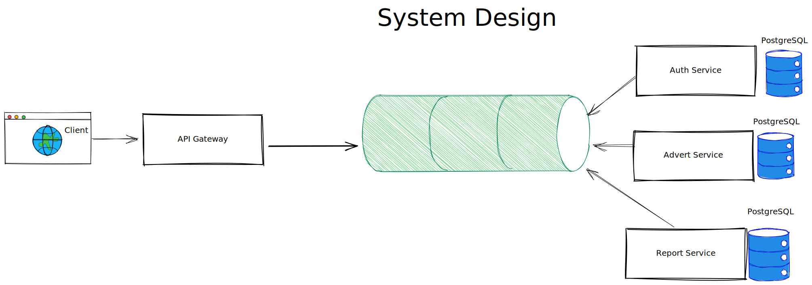

# Real Estate Advert System

## Introduction

Spring Boot framework of a restful application for an advertisement system, which receives the advertisement information and creates an advertisement record.

### Non-Functional Requirements

* Test-driven development
* Event-Driven Architecture
* Containerization with Docker
* Documentation with Swagger
* Code Quality and Code Security Sonarlint
* Testing with Code Coverage > 80%

### Architecture

### Tech Stack

## Project Information

### Prerequisites

### Quick Start

### End-points

### Messaging Infrastructure & Domain Events

### Event Types being used
